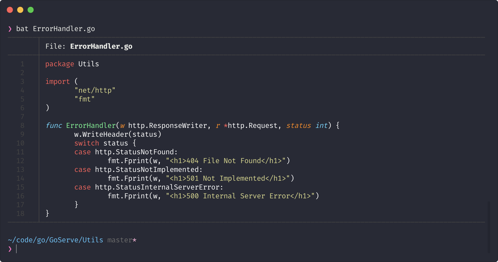
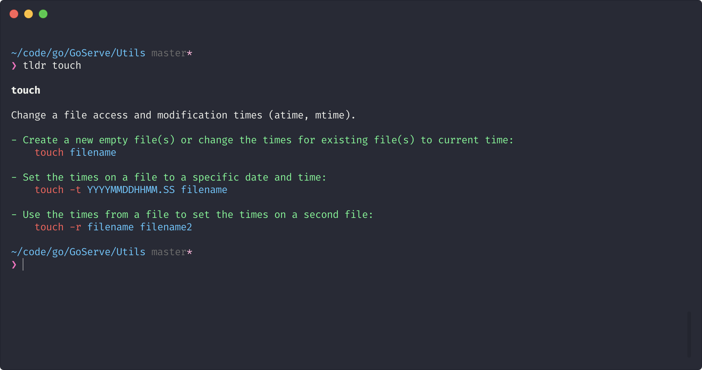

I came across an [interesting article](https://zaiste.net/posts/shell-commands-rust/) about some of the more common Unix CLI tools being rewritten in Rust and given a lick of new paint.
I had been using some of these tools before reading the article and I have definitely noticed the benefits they have over the traditional implementations.

### [`bat`](https://github.com/sharkdp/bat)

`bat` is a replacement for `cat` but with some neat additions such as

-   syntax highlighting
-   git integration (additions and deletions)
-   the output format is conditional, e.g. if the height of the output is greater than your terminal height then it will be piped into `less`

### [`fd`](https://github.com/sharkdp/fd)

Not much to say about `fd`, it's a replacement for `find` but without the clunky syntax. Instead of having to use `find -iname ‘*PATTERN*’`, now it's as simple as `fd PATTERN`.
Another neat addition is that `fd` respects your `.gitignore` file, so it doesn't waste time combing through your node_modules.

### [`tealdeer`](https://github.com/dbrgn/tealdeer)

I haven't specifically used `tealdeer`, but any tool that aims to improve the wonderful [`tldr`](https://github.com/tldr-pages/tldr) is great in my book.

---

Read the [full article](https://zaiste.net/posts/shell-commands-rust/) for more modern CLI rewrites.
