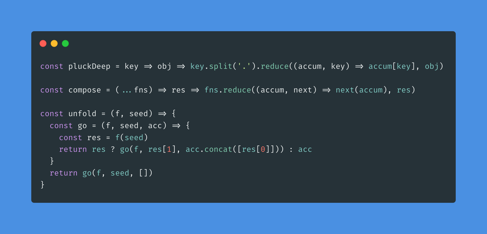
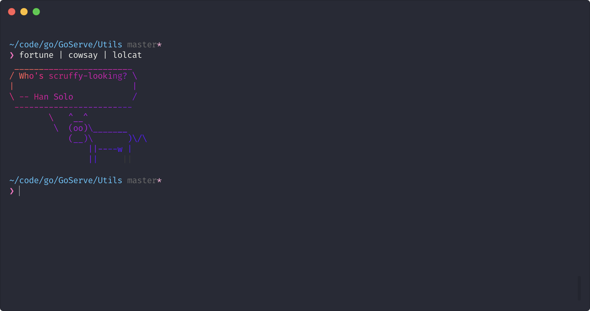

A tough part of any project is making it look good enough for someone else to care about. Here are some of the ways I try to trick people into thinking I make good stuff.

### Code screenshots
https://carbon.now.sh/ is your best friend. Simply copy and paste a code snippet onto the website and watch as your `O(2^n)` sorting algorithm is turned into some pastel goodness.
There are [a variety](https://github.com/carbon-app/carbon#community) of community built clients for `carbon` so you don't even have to leave your IDE/Terminal of choice.

Here is an example of the kind of image carbon creates:

### Terminal screenshots
The best course of action here depends on what you want. If you need to show how you can interact with a CLI you likely want a GIF rather than a still image. For this I recommend [AsciiCinema](https://asciinema.org/) or [Terminalizer](https://github.com/faressoft/terminalizer).
I don't have much experience with either of these but Terminalizer looks more 'hip'.
In terms of still images, I haven't found anything to beat the built in macOS screenshot utilities. That being said it does require some setup.

#### Getting your terminal to look just right
Although I use [iTerm2](https://www.iterm2.com/) as my day to day terminal emulator, I have set up [Hyper](https://hyper.is/) to be my 'sexy' terminal, with a cleaner prompt. Specifically I am using [pure](https://github.com/sindresorhus/pure).

#### Taking screenshots
So taking a screenshot on a mac is intuitive. Taking the right screenshot on a mac requires a PhD. I have to say having a touchbar helps here as it provides easy configuration for what you want to take a picture of and where to save it.
[This page](https://support.apple.com/en-us/HT201361) summarises the different screenshots you can take on a Mac but I will summarize here
- Press ⌘ + ⇧ + 3 to take a screenshot of the entire screen
- Press ⌘ + ⇧ + 4 to draw the area you want a screenshot of
- Press ⌘ + ⇧ + 4 + Space to be able to select an application/window to take a screenshot of
  - This by default will lead to a screenshot with a transparant border and some box shadow around the target image, to disable this you also need to press ⌥ when clicking on the desired window

So now you've set your terminal up nicely, and crippled your fingers from pressing all the right keys, you should have a screenshot that looks something like:

---
P.S thanks to https://copychar.cc/symbols/ for giving me an easy way of getting the unicode characters for the mac key symbols.
